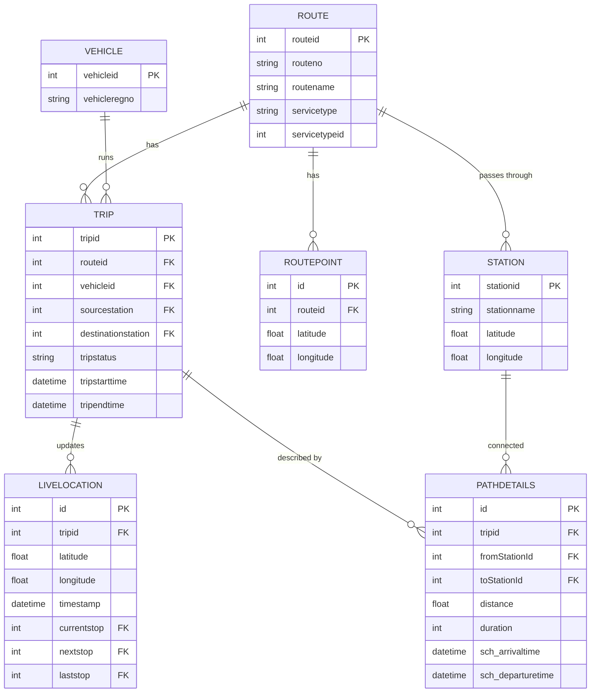

# ER Diagram

_NOTE: Generated using ChatGPT based on the API documentation._

```mermaid
erDiagram
    ROUTE {
        int routeid PK
        string routeno
        string routename
        string servicetype
        int servicetypeid
    }

    STATION {
        int stationid PK
        string stationname
        float latitude
        float longitude
    }

    ROUTEPOINT {
        int id PK
        int routeid FK
        float latitude
        float longitude
    }

    VEHICLE {
        int vehicleid PK
        string vehicleregno
    }

    TRIP {
        int tripid PK
        int routeid FK
        int vehicleid FK
        int sourcestation FK
        int destinationstation FK
        string tripstatus
        datetime tripstarttime
        datetime tripendtime
    }

    LIVELOCATION {
        int id PK
        int tripid FK
        float latitude
        float longitude
        datetime timestamp
        int currentstop FK
        int nextstop FK
        int laststop FK
    }

    PATHDETAILS {
        int id PK
        int tripid FK
        int fromStationId FK
        int toStationId FK
        float distance
        int duration
        datetime sch_arrivaltime
        datetime sch_departuretime
    }

    ROUTE ||--o{ ROUTEPOINT : "has"
    ROUTE ||--o{ TRIP : "has"
    ROUTE ||--o{ STATION : "passes through"
    VEHICLE ||--o{ TRIP : "runs"
    TRIP ||--o{ LIVELOCATION : "updates"
    TRIP ||--o{ PATHDETAILS : "described by"
    STATION ||--o{ PATHDETAILS : "connected"
```