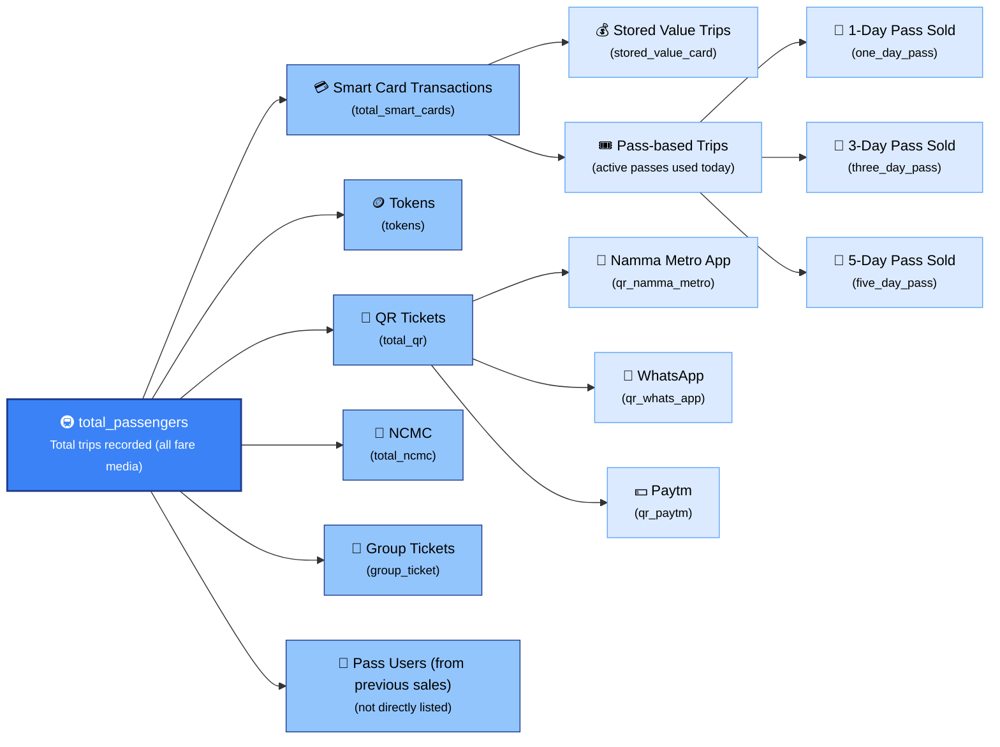

# README

```mermaid
flowchart LR

    A["🚇 total_passengers<br><small>Total trips recorded (all fare media)</small>"]

    %% Level 1 breakdown
    A --> B["💳 Smart Card Transactions<br><small>(total_smart_cards)</small>"]
    A --> C["🪙 Tokens<br><small>(tokens)</small>"]
    A --> D["📱 QR Tickets<br><small>(total_qr)</small>"]
    A --> E["💠 NCMC<br><small>(total_ncmc)</small>"]
    A --> F["👥 Group Tickets<br><small>(group_ticket)</small>"]
    A --> G["🎫 Pass Users (from previous sales)<br><small>(not directly listed)</small>"]

    %% Smart card subcategories
    B --> B1["💰 Stored Value Trips<br><small>(stored_value_card)</small>"]
    B --> B2["🎟 Pass-based Trips<br><small>(active passes used today)</small>"]

    %% Pass sales (do not equal pass trips)
    B2 --> H["📆 1-Day Pass Sold<br><small>(one_day_pass)</small>"]
    B2 --> I["📆 3-Day Pass Sold<br><small>(three_day_pass)</small>"]
    B2 --> J["📆 5-Day Pass Sold<br><small>(five_day_pass)</small>"]

    %% QR breakdown
    D --> D1["📲 Namma Metro App<br><small>(qr_namma_metro)</small>"]
    D --> D2["💬 WhatsApp<br><small>(qr_whats_app)</small>"]
    D --> D3["💵 Paytm<br><small>(qr_paytm)</small>"]

    %% Style tweaks
    classDef total fill:#3b82f6,stroke:#1e3a8a,stroke-width:2px,color:#fff;
    classDef category fill:#93c5fd,stroke:#1e3a8a,color:#000;
    classDef subcategory fill:#dbeafe,stroke:#60a5fa,color:#000;

    class A total;
    class B,C,D,E,F,G category;
    class B1,B2,D1,D2,D3,H,I,J subcategory;
```